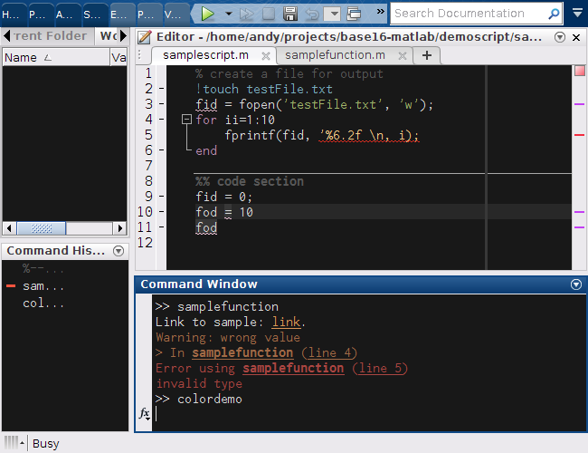

# Base16 MATLAB

This is a set of color schemes for the MATLAB desktop GUI and editor.
The color scheme files are automatically generated with 
[template files](https://github.com/andymass/base16-matlab/tree/master/templates)
using the new
[Base16 builder](https://github.com/chriskempson/base16-builder-php).

See the [Base16 repository](https://github.com/chriskempson/base16)
for more information.

Each color scheme has two color assignments with subtle variations in their
syntax highlighting.  See [Installation](#installation) for instructions.

## Example

Scheme _default-dark_:



See [here](https://github.com/andymass/base16-matlab/wiki) for (many)
additional screenshots.

## Installation

To install Base16 MATLAB, download or clone the repository to 
any location of your choice (after applying a scheme you 
may optionally delete these Base16 MATLAB files; MATLAB will
preserve the color scheme without the files).

First ensure the installation directory is on the MATLAB path by either
```matlab
addpath('base16-matlab-master') % replace with directory containing apply_colors.m
```
or by changing the current directory through the MATLAB GUI or using
```matlab
cd('base16-matlab-master')      % replace with directory containing apply_colors.m
```

To apply a particular Base16 color scheme, run the supplied `apply_colors` script 
from within MATLAB, passing the name of the scheme (no Base16 prefix).  

> :warning: This will permanently change the colors of the 
MATLAB desktop and your scheme will be preserved upon restart.  To restore 
the default colors you must use the MATLAB GUI (in HOME /
Preferences).

```matlab
apply_colors('default-dark')
apply_colors('default-light')
```

> :cold_sweat: The MATLAB files in `colors/` cannot be run directly 
because their filenames contain hyphens.  If you would like to use them
manually you will need to rename them (e.g. in bash,
`for x in base16-*.m; do mv $x ${x//-/_};done`)
and set up the `base16_opts` structure manually.

### Options and variants

Each Base16 MATLAB scheme currently supports two options:

  - You can choose to suppress the highlighting of the
editor line currently under the cursor 
by setting the second argument of `apply_colors` to `0`.
The default behavior (equivalent to an argument of `1`) is to 
highlight the cursor line.
  - Each scheme also has an alternate color assignment which may look
better for some schemes.  You can specify this using the third argument to
`apply_colors`; `0` or `1` (default).

```matlab
cd('base16-matlab-master')
apply_colors('default-dark', 0, 0)
%                             \  \_[ do use alternate ]
%                              \___[ do not highlight cursor line ]
```

